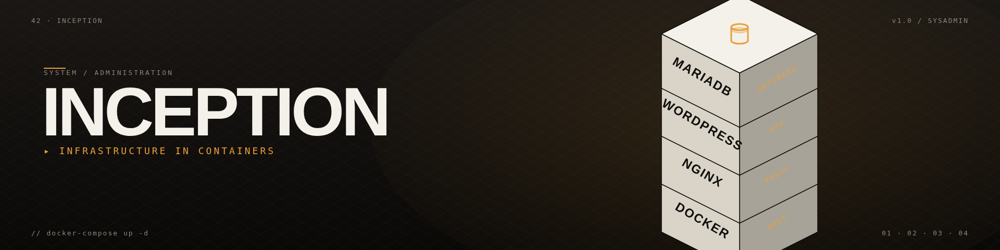

<div align="center">



# 🐳 Inception — Dockerized Web Infrastructure

### *A complete multi-service web stack built from scratch — NGINX, WordPress, MariaDB, Redis, Grafana & more — all in custom Docker containers.*


</div>

---

*This project has been created as part of the 42 curriculum by aledos-s.*


---

## 🎯 Overview

**Inception** is a system-administration project from 42 school. The goal: build a **complete, production-style web infrastructure** using **Docker** and **Docker Compose**, running inside a Virtual Machine.

Every service ships in its own dedicated container — built from scratch using **custom Dockerfiles based on `debian:bullseye`**. No pre-built images from DockerHub are used (except the Debian base).

**What makes it interesting:**

- ✅ **From-scratch** Dockerfiles — no pulling `wordpress:latest`, everything compiled/configured by hand
- ✅ **Docker secrets** instead of environment variables for passwords
- ✅ **Custom bridge network** — containers talk by service name
- ✅ **Auto-configured** WordPress via WP-CLI on first boot
- ✅ **Full observability** (bonus): Prometheus + cAdvisor + Grafana

---

## 🎬 Demo

<!-- TODO: add a screenshot of the WordPress site + a Grafana dashboard -->

**Stack at a glance:**

```
          ┌─────────────── port 443 (TLS 1.2/1.3) ───────────────┐
                                │
                           ┌────▼────┐
                           │  NGINX  │  ← only entry point
                           └────┬────┘
                                │  (inception bridge network)
         ┌──────────┬───────────┼───────────┬──────────┐
         │          │           │           │          │
    ┌────▼────┐ ┌──▼───┐  ┌────▼────┐  ┌────▼────┐ ┌──▼────┐
    │WordPress│ │Static│  │ Adminer │  │ Grafana │ │  FTP  │
    │ + PHP   │ │ site │  └────┬────┘  └────┬────┘ └───────┘
    └────┬────┘ └──────┘       │            │
         │                     │            │
    ┌────▼────┐          ┌─────▼─────┐ ┌───▼─────┐ ┌───────────┐
    │ MariaDB │◄─────────┤   Redis   │ │Prometheus│◄┤ cAdvisor │
    └─────────┘          └───────────┘ └──────────┘ └───────────┘
```

**Services:**

| Type | Service | Role |
|------|---------|------|
| 🟢 Mandatory | **NGINX** | Web server, sole entry point (port 443, TLS 1.2/1.3) |
| 🟢 Mandatory | **WordPress + PHP-FPM** | Main website |
| 🟢 Mandatory | **MariaDB** | WordPress database |
| 🟡 Bonus | **Redis** | Cache layer for WordPress |
| 🟡 Bonus | **Adminer** | Web UI to manage the database |
| 🟡 Bonus | **vsftpd** | FTP access to the WordPress volume |
| 🟡 Bonus | **Static site** | Plain HTML portfolio page |
| 🟡 Bonus | **Prometheus** | Metrics collection |
| 🟡 Bonus | **cAdvisor** | Per-container metrics exporter |
| 🟡 Bonus | **Grafana** | Monitoring dashboards |

---

## 🚀 Quick Start

### Prerequisites

- Linux Virtual Machine
- Docker & Docker Compose installed
- `make`
- User added to the `docker` group: `sudo usermod -aG docker $USER`

### Setup

```bash
# 1. Clone
git clone git@github.com:XI-X-IX/Inception.git
cd Inception

# 2. Environment
cp srcs/.env.example srcs/.env
# → edit srcs/.env with your values

# 3. Secrets (never committed)
mkdir -p secrets
echo "your_db_password"    > secrets/db_password.txt
echo "your_root_password"  > secrets/db_root_password.txt
echo "your_admin_password" > secrets/admin_password.txt
echo "your_user2_password" > secrets/user2_password.txt
echo "your_ftp_password"   > secrets/ftp_password.txt

# 4. Local DNS
echo "127.0.0.1 aledos-s.42.fr" | sudo tee -a /etc/hosts

# 5. Launch
make
```

### Access

| Service | URL |
|---------|-----|
| WordPress | `https://aledos-s.42.fr` |
| WordPress admin | `https://aledos-s.42.fr/wp-admin` |
| Adminer | `https://aledos-s.42.fr/adminer` |
| Grafana | `https://aledos-s.42.fr/grafana/` |
| Static site | `https://aledos-s.42.fr/static` |

> Your browser will warn about the self-signed SSL certificate — click **Advanced** → **Accept** to continue.

### Makefile commands

| Command | Description |
|---------|-------------|
| `make` | Build and start all containers |
| `make down` | Stop containers (data preserved) |
| `make clean` | Stop containers and remove images |
| `make fclean` | Remove everything including data |
| `make re` | Full rebuild from scratch |
| `make logs` | Follow all container logs |
| `make ps` | Show container status |

---

## 🧩 Design Choices

- All images based on `debian:bullseye` for consistency
- Passwords **never** written in Dockerfiles or `.env` — they live in Docker secrets (plain text files mounted read-only into containers)
- All containers restart automatically on crash (`restart: always`)
- WordPress fully configured at first startup via WP-CLI — no manual setup
- Redis cache activated at WordPress first boot

---

## 📘 Core Concepts

### Virtual Machines vs Docker

| | Virtual Machine | Docker Container |
|---|---|---|
| **Isolates** | Full OS + kernel | Just the process and its dependencies |
| **Size** | Several GB | A few MB to a few hundred MB |
| **Boot time** | Minutes | Seconds |
| **Use case** | Full OS isolation | Isolated, reproducible services |

A VM virtualizes hardware and runs a full OS. Docker containers share the host kernel and only isolate the process — much lighter and faster to start, with less isolation than a VM. In this project, Docker runs **inside** a VM, combining both approaches.

### Secrets vs Environment Variables

| | Secrets | Environment Variables |
|---|---|---|
| **Stored in** | Files on disk, mounted read-only | `.env` file or `environment:` block |
| **Visible in** | Only inside the container at runtime | `docker inspect`, process list |
| **Used for** | Passwords, API keys | Usernames, URLs, config values |

Env vars are convenient but can leak (e.g. via `docker inspect`). Secrets mount at `/run/secrets/` inside the container and never travel through the environment — safer for passwords.

### Docker Network vs Host Network

| | Docker Network (bridge) | Host Network |
|---|---|---|
| **Isolation** | Containers isolated from the host | Container shares the host's network stack |
| **Communication** | By service name (DNS resolution) | By localhost |
| **Security** | Better — ports must be explicitly exposed | Weaker — all host ports accessible |
| **Required by subject** | ✅ Yes | ❌ Forbidden |

All containers communicate through a custom bridge network called `inception`. They reach each other by name (e.g. `wordpress` → `mariadb`). Only NGINX exposes a port externally (443).

### Docker Volumes vs Bind Mounts

| | Named Volumes | Bind Mounts |
|---|---|---|
| **Managed by** | Docker | You (host path) |
| **Host path** | Automatic (or configurable) | Explicit path required |
| **Portability** | Better | Tied to the host filesystem |
| **Allowed by subject** | ✅ Yes | ❌ Forbidden for main data |

This project uses named volumes with a fixed host path (`/home/aledos-s/data/`) configured via `driver_opts` — satisfying the subject's requirement while storing data at a predictable location.

---

## 🗺️ Roadmap

- [ ] **Let's Encrypt** automated TLS certificates (Certbot container) instead of self-signed
- [ ] **Healthchecks** on every container with proper startup dependencies
- [ ] **Backups** — scheduled `mysqldump` + WordPress volume snapshots to S3-compatible storage
- [ ] **Loki + Promtail** — aggregate container logs alongside Prometheus metrics
- [ ] **Alertmanager** — route critical alerts (disk full, container down) to email/Telegram
- [ ] Migrate to **rootless Docker** to reduce host surface area
- [ ] Convert to a **Docker Swarm** or lightweight **K3s** deployment for HA

---

## 🎓 What I learned

- **Containers are processes, not VMs** — a Docker image is a filesystem + a command, nothing more
- **PID 1 matters** — signal handling, zombie reaping, why `exec form` (not `shell form`) is the default
- **Layer caching** — every Dockerfile instruction creates a layer; order them from least-to-most-volatile
- **Secrets discipline** — env vars leak; files mounted read-only are the right answer for passwords
- **Networking** — bridge networks give you DNS-based service discovery for free; host networking defeats the purpose
- **Volumes vs bind mounts** — when Docker manages the filesystem, backups, permissions, and portability become simpler
- **WP-CLI automation** — a CMS that usually requires a web wizard can be fully provisioned with a script
- **Observability from scratch** — Prometheus pulls metrics, cAdvisor exposes container stats, Grafana visualizes — each piece is simple, the whole is powerful

---

## 📚 Resources

### Documentation
- [Docker official documentation](https://docs.docker.com/)
- [Docker Compose reference](https://docs.docker.com/compose/compose-file/)
- [NGINX documentation](https://nginx.org/en/docs/)
- [WordPress CLI (WP-CLI)](https://wp-cli.org/)
- [MariaDB documentation](https://mariadb.com/kb/en/)
- [Redis documentation](https://redis.io/docs/)
- [Prometheus documentation](https://prometheus.io/docs/)
- [Grafana documentation](https://grafana.com/docs/)
- [cAdvisor GitHub](https://github.com/google/cadvisor)

### Articles and tutorials
- [Best practices for writing Dockerfiles](https://docs.docker.com/develop/develop-images/dockerfile_best-practices/)
- [PID 1 problem in containers](https://cloud.google.com/architecture/best-practices-for-building-containers#signal-handling)
- [Docker secrets explained](https://docs.docker.com/engine/swarm/secrets/)
- [Understanding Docker networking](https://docs.docker.com/network/)

### How AI was used in this project

AI (Claude by Anthropic) was used as a learning and productivity tool throughout the project:

- **Debugging** — understanding error messages from Docker builds and container logs
- **Dockerfile structure** — explanations on best practices (PID 1, exec form, layer caching)
- **Configuration files** — initial versions of `nginx.conf`, `vsftpd.conf`, `prometheus.yml` and `grafana.ini`, then reviewed, tested and adjusted manually
- **Documentation** — help structuring and writing this README, `USER_DOC.md` and `DEV_DOC.md`

All AI-generated content was reviewed, understood, and tested before being included in the project.

---

## 📜 Context

Part of the **42 Lausanne** curriculum — *Inception* project, System Administration track (Circle 5).
